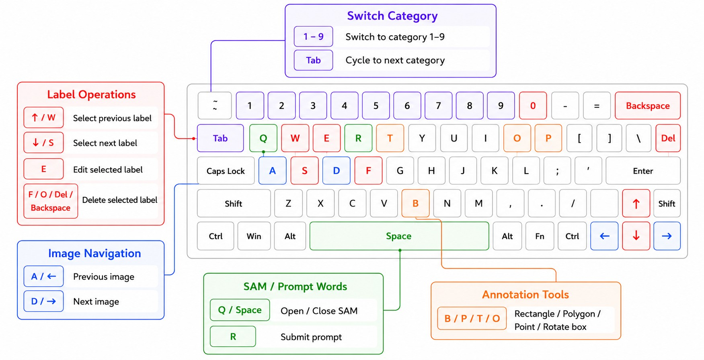

# PromptLabel

**Language**: [中文](README.md) | English

<p align="center">
  
</p>

PromptLabel is a SAM3-based prompt-assisted image annotation workbench. It separates “prompt wording” from “training classes”: you can use multiple prompt aliases to find the same target while keeping exported YOLO classes clean and stable.

The interface and basic annotation workflow are adapted from [LabelPaw](https://github.com/luohuabuxiema/LabelPaw). This is not an official version from the original author.

## Core Highlights

### One Class, Multiple Prompts

One training class can have multiple prompt aliases, for example:

```text
helmet
├─ helmet
├─ hard hat
└─ ...
```

When using SAM text prompts, any alias can be used to find the target. Saving and exporting still write only the `helmet` class, so the dataset class list stays clean.

### Faster Continuous Annotation

Frequent actions have keyboard paths: `A` / `D` switch images, `1` - `9` or `Tab` switch classes, `Q` / `Space` toggles SAM, and `R` submits the prompt. Together with auto-save and status-bar feedback, this keeps continuous review and labeling from being interrupted.

### Compact Workbench

The UI is organized around a left image queue, central canvas, right class/annotation manager, and bottom SAM workflow. After opening a folder, you can browse thumbnails, select multiple images for batch prompt annotation, and manage classes, prompt aliases, colors, and visibility from the right panel.

## Screenshot


## Feature Overview

- Annotation formats: `JSON` / `YOLO` / `XML`.
- Annotation types: rectangle, polygon, point, rotated box.
- SAM3 assistance: point selection, text prompts, reference target search.
- Class management: add, edit, delete, color, show/hide, prompt aliases.
- Image queue: thumbnails, multi-select checkboxes, previous/next image, batch prompt annotation, right-click deletion for images and same-name annotations.
- Annotation management: grouped by type, selection, batch relabeling, batch deletion, breathing highlight.
- Dataset processing: train/validation/test split, JSON/XML to YOLO, JSON to U-Net Mask.

## Model Notes

Release packages do not include `models/sam3.pt`. When the model is missing, the main interface still opens, and manual annotation plus dataset processing remain available. SAM assistance is disabled. On first launch, you can select an existing `sam3.pt` file directly; the app remembers the path. You can also place the model at:

```text
models/sam3.pt
```

Prefer official sources:

- [facebook/sam3 on Hugging Face](https://huggingface.co/facebook/sam3/tree/main)
- [facebookresearch/sam3](https://github.com/facebookresearch/sam3)

Backup download:

- [Baidu Netdisk sam3.pt](https://pan.baidu.com/s/11rKzO6W5b_i8aOFcd9xOzA?pwd=6666), extraction code: `6666`

`sam3.pt` belongs to SAM Materials and is governed by `SAM_LICENSE.txt`. Confirm compliance with Meta's SAM License before use or redistribution.

## How to Run

### Beta Portable Package

1. Download the `PromptLabel-vX.X.X` portable package from the Release page.
2. Extract it into one directory.
3. Optional: put `sam3.pt` at `models/sam3.pt`.
4. Double-click `PromptLabel.exe` to start.

### Run from Source

Recommended environment: Windows + Python 3.11 + NVIDIA CUDA.

```powershell
python -m venv .venv311
.\.venv311\Scripts\pip install -r requirements.txt
.\.venv311\Scripts\python main.py
```

### Local Packaging

```powershell
.\.venv311\Scripts\pip install pyinstaller
.\.venv311\Scripts\pyinstaller.exe --clean --noconfirm PromptLabel.spec
```

The output directory is `dist\PromptLabel\`. Release packages should not include `models\sam3.pt`, `.sam3_tmp\`, logs, caches, or local test images.

## Shortcuts

<p align="center">
  
</p>

## Auto-Save

PromptLabel is built around auto-save. Switching images, editing annotations, and deleting annotations are automatically saved to the current format. The status bar shows total and per-class counts for the current annotation mode.

## License

This project follows the original project license and keeps `SAM_LICENSE.txt` for SAM3-related license information.
