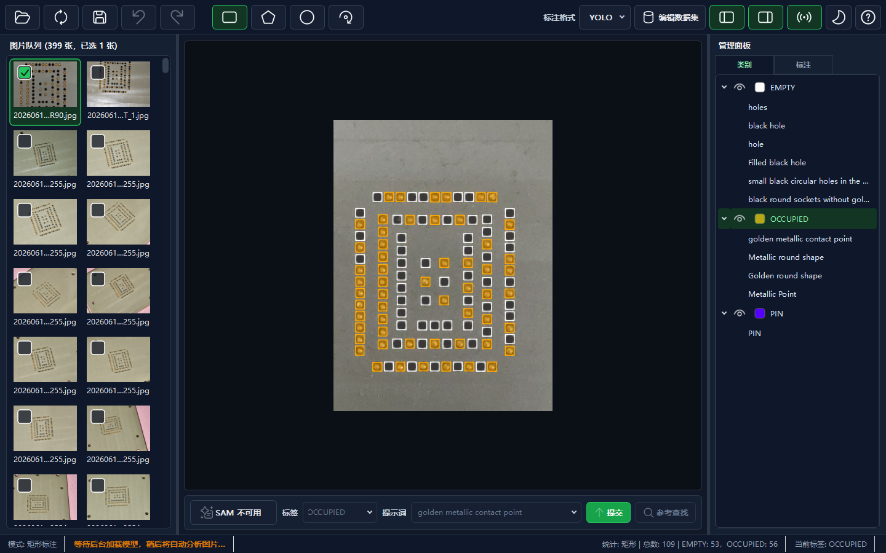

# PromptLabel

**语言**：中文 | [English](README.en.md)

<p align="center">
  
</p>

PromptLabel 是一个基于 SAM3 的提示词辅助图像标注工作台，重点是用文本提示词快速定位目标，再保存为常见训练集标注格式。项目在界面和基础标注流程上参考并改造了 [LabelPaw](https://github.com/luohuabuxiema/LabelPaw)，不是原作者官方版本。

## 核心卖点

### 一个类别，多个提示词

这是 PromptLabel 最重要的改动。允许一个 YOLO 类别绑定多个提示词别名，例如：

```text
helmet
├─ helmet
├─ hard hat
└─ safety helmet
```

使用 SAM 文本提示时，可以用任意别名去找目标；保存和导出时仍然只写入同一个 YOLO 类别 `helmet`。这样既能保留提示词的灵活性，也不会把训练集类别搞乱。

### 少点鼠标，快捷键快速标注

PromptLabel 尽量把连续标注里的高频动作放到键盘上：`A` / `D` 切换图片，`1` - `9` 切换当前类别，`Q` / `Space` 开关 SAM，`R` 提交提示词。配合自动保存、状态栏反馈和右侧标注列表，常见流程可以少点鼠标、少打断地完成。

### 左侧图集预览

打开目录后，当前目录下的图片会作为“图片队列”显示在左侧：缩略图、文件名和图片总数都能直接看到。连续标注时不用反复打开文件选择器，也更容易快速扫完整个目录。

### 紧凑标注工作台

界面重新组织为左侧图片队列、中央画布、右侧类别/标注管理、底部 SAM 工作流。相比原界面，PromptLabel 更强调画布空间、信息密度和少打断操作。

### 界面截图

主界面围绕“图片队列 - 画布 - 管理面板 - SAM 工作流”组织，适合连续切图、标注和校对：



### 更少打扰的小优化

- 提示词下拉框滚动只切换内容，不会误提交 SAM 提示词。
- 标签下拉框支持鼠标滚轮顺滑切换当前类别。
- 标注框支持可关闭的呼吸高亮，方便快速识别已有标注。
- 类别树里直接管理提示词别名、颜色、显示/隐藏状态。
- 标注列表按矩形、多边形、点、旋转框分组，支持选择、批量改标签、删除。
- 画布右键支持切换当前标签、批量修改选中标注类别、打开/关闭 SAM。
- 常用动作都有键盘入口，连续切图、切模式、切类别、提交提示词时可以减少鼠标点击。
- 状态栏显示当前标注模式下的总标注数和每个类别的数量。
- 图片切换时会防抖触发 SAM 分析，连续按 `A` / `D` 时不会每张图都立即跑模型。
- 减少吐司消息，更多信息放到状态栏，避免遮挡画布。
- 下拉框和树形控件的小三角样式已统一，深色/浅色主题都可见。

## 功能保留

- 标注格式：`JSON` / `YOLO` / `XML`
- 标注类型：矩形、多边形、点、旋转框
- SAM3 辅助：点选、文本提示词、参考查找
- 类别管理：新增、编辑、删除、颜色、显示/隐藏、提示词别名
- 图片目录：缩略图队列、图片数量统计、上一张/下一张、右键删除图片及标注
- 常用操作：自动保存、撤销、重做、删除、批量选择、批量修改标注类别、当前模式和标注数量统计
- 数据集处理：划分训练/验证/测试集，JSON/XML 转 YOLO，JSON 转 U-Net Mask

## 模型说明

Release 不内置 `models/sam3.pt`。缺少模型时，主界面仍可打开，手动标注和数据集处理可以继续使用，SAM 智能辅助不可用。启动时也可以点“我已下载”直接选择已有的 `sam3.pt` 文件，程序会记住路径，不要求复制到项目目录。

建议优先从官方来源下载：

- [facebook/sam3 on Hugging Face](https://huggingface.co/facebook/sam3/tree/main)
- [facebookresearch/sam3](https://github.com/facebookresearch/sam3)

备用下载：

- [百度网盘 sam3.pt](https://pan.baidu.com/s/11rKzO6W5b_i8aOFcd9xOzA?pwd=6666)，提取码：`6666`

`sam3.pt` 属于 SAM Materials，受 `SAM_LICENSE.txt` 约束。备用网盘只是为了方便下载，使用和再分发前请确认遵守 Meta 的 SAM License。

下载后可以在弹窗里直接选择文件，或放到默认路径：

```text
models/sam3.pt
```

## 运行方式

### Beta 便携包

1. 从 Release 页面下载 `PromptLabel-vX.X.X` 便携包。
2. 解压到同一个目录。
3. 将 `sam3.pt` 放到 `models/sam3.pt`。
4. 双击 `PromptLabel.exe` 启动。

### 源码运行

推荐 Windows + Python 3.11 + NVIDIA CUDA 环境。

```powershell
python -m venv .venv311
.\.venv311\Scripts\pip install -r requirements.txt
.\.venv311\Scripts\python main.py
```

### 本地打包

仓库已提供 `PromptLabel.spec`。打包前确认 `.venv311` 中已安装依赖和 PyInstaller：

```powershell
.\.venv311\Scripts\pip install pyinstaller
.\.venv311\Scripts\pyinstaller.exe --clean --noconfirm PromptLabel.spec
```

输出目录为 `dist\PromptLabel\`。Release 包不应内置 `models\sam3.pt`、`.sam3_tmp\`、日志、缓存或本地测试图片；用户可在首次启动时选择已有模型文件，或放到 `models\sam3.pt`。

## 快捷键

| 快捷键 | 功能 |
| ------ | ---- |
| `A` / `←` | 上一张图片 |
| `D` / `→` | 下一张图片 |
| `R` | 提交 SAM 提示词 |
| `B` / `P` / `T` / `O` | 矩形 / 多边形 / 点 / 旋转框 |
| `Q` / `Space` | 开启/关闭 SAM |
| `F` / `0` / `Del` / `Backspace` | 删除选中标注 |
| `Ctrl + Z` | 撤销 |
| `Ctrl + Y` / `Ctrl + Shift + Z` | 重做 |
| `Ctrl + A` | 选择当前标注类型分组内的全部标注 |
| `1` - `9` | 切换当前类别 |
| `↑` / `W` | 在当前标注类型列表中选择上一个标注 |
| `↓` / `S` | 在当前标注类型列表中选择下一个标注 |
| `E` | 修改选中标注标签 |
| `F1` | 打开帮助 |

## 右键菜单

- 画布右键：打开/关闭 SAM、提交 SAM 提示词、切换当前标签、新建标签；当鼠标位于已选标注上时，可批量修改选中标注类别。
- 右侧标注列表右键：批量修改标注类别、批量删除标注。
- 左侧图片队列右键：复制文件名、打开所在目录、删除图片及同名标注文件。

## 自动保存和状态栏

PromptLabel 以自动保存为主，不再把“保存”作为高频按钮。切换图片、修改标注、删除标注等操作会自动保存到当前格式。

状态栏会显示当前标注模式下的统计，例如：

```text
统计: 矩形 | 总数: 12 | helmet: 5，vest: 7
```

## License

本项目沿用原项目许可，并保留 `SAM_LICENSE.txt` 用于说明 SAM3 相关许可信息。
