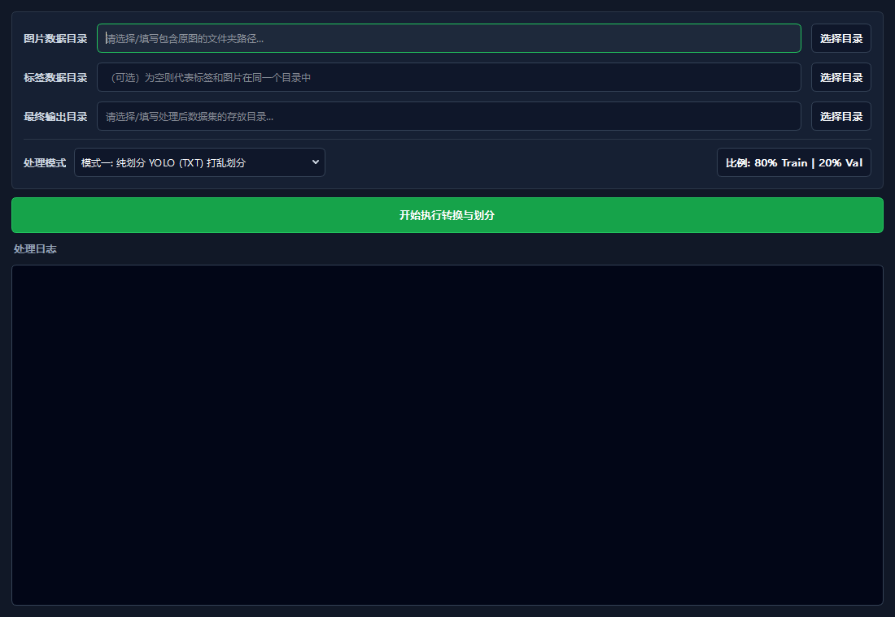

# PromptLabel

PromptLabel 是基于 [luohuabuxiema/LabelPaw](https://github.com/luohuabuxiema/LabelPaw) 改造的 Windows 图像标注工作台。当前分支的核心目标不是新增标注格式，而是把原工具重构成更紧凑、更清晰、更适合连续标注的生产界面。

> Beta 说明：当前版本仍处于 beta 阶段，功能已可用，但打包体积、显存占用和少量边界交互仍会继续优化。

## 与上游的主要区别

- 重新设计主界面：左侧图片队列、中央画布、右侧类别/标注管理、底部 SAM 工作流。
- 重做深色/浅色主题、字体、下拉框/树形控件箭头、状态栏提示和紧凑控件密度。
- 优化提示词工作流：提示词历史可滚动切换但不会误提交；SAM 控制集中在工作区底部。
- 类别支持提示词别名：**多个提示词可以对应同一个 YOLO 类别**，导出时仍按类别名写入，不改变训练标签语义。
- 标注框增加可关闭的呼吸高亮，用于更容易识别当前图片已有标注。

## 界面预览

| 功能 | 截图 |
| ---- | ---- |
| 紧凑标注工作台 |  |
| 数据集处理工具 |  |

## 功能

- 图片目录打开、缩略图浏览、上一张/下一张、已标注状态提示。
- 标注格式：`JSON`、`YOLO`、`XML`。
- 标注模式：矩形、多边形、点、旋转框，快捷键为 `R/P/T/O`。
- SAM3 辅助：点选提取、提示词分割、参考目标查找。
- 类别管理：颜色、显示/隐藏、当前类别、提示词别名。
- 标注管理：按形状类型分组，支持选择、改标签、删除。
- 数据集处理：划分训练/验证/测试集，JSON/XML 到 YOLO，JSON 到 U-Net Mask。
- 撤销/重做、保存、删除、坐标状态、主题切换。

## Beta 便携包运行

1. 在 Release 页面下载 `PromptLabel-v0.1.0-beta.1` 便携包。
2. 解压所有压缩包到同一个目录。
3. 下载 SAM3 权重 `sam3.pt`，放到解压目录的 `models/sam3.pt`。
4. 双击 `PromptLabel.exe` 启动。

SAM3 权重不随 release 提供，请优先从官方页面下载：

- [facebook/sam3 on Hugging Face](https://huggingface.co/facebook/sam3/tree/main)
- [facebookresearch/sam3](https://github.com/facebookresearch/sam3)

备用下载：

- 百度网盘：[sam3.pt](https://pan.baidu.com/s/1B1wqcEgTeTckvOlZyVkm3w)，提取码：`6666`

SAM3 权重属于 SAM Materials，受 `SAM_LICENSE.txt` 约束。备用镜像仅为方便下载，使用和再分发前请确认遵守 Meta 的 SAM License。

缺少 `models/sam3.pt` 时，主界面仍可打开，手动标注和数据集处理可继续使用；SAM 智能辅助会不可用。

## 源码运行

推荐 Windows + Python 3.11 + NVIDIA CUDA 环境。

```powershell
python -m venv .venv311
.\.venv311\Scripts\pip install -r requirements.txt
```

下载 `sam3.pt` 后放入：

```text
models/sam3.pt
```

启动：

```powershell
.\.venv311\Scripts\python main.py
```

## 快捷键

| 快捷键 | 功能 |
| ------ | ---- |
| `A` / `←` | 上一张图片 |
| `D` / `→` | 下一张图片 |
| `Ctrl + S` | 保存当前标注 |
| `R` / `P` / `T` / `O` | 矩形 / 多边形 / 点 / 旋转框 |
| `Q` / `Space` | 开启/关闭 SAM |
| `Del` / `Backspace` | 删除选中标注 |
| `Ctrl + Z` | 撤销 |
| `Ctrl + Y` / `Ctrl + Shift + Z` | 重做 |
| `1` - `9` | 切换当前类别 |
| `E` | 修改选中标注标签 |
| `F1` | 打开帮助 |

## 说明

- PromptLabel 是独立改造版本，不是 LabelPaw 官方版本。
- YOLO 类别以类别名为准；提示词别名只影响 SAM 文本检索和工作流，不会新增导出类别。
- Release 不包含大模型权重，避免仓库和发布包过大。
- 当前 beta 包面向 Windows CUDA 环境；低显存设备可能无法稳定使用 SAM3。

## License

本项目沿用原项目许可，并保留 `SAM_LICENSE.txt` 用于说明 SAM3 相关许可信息。
