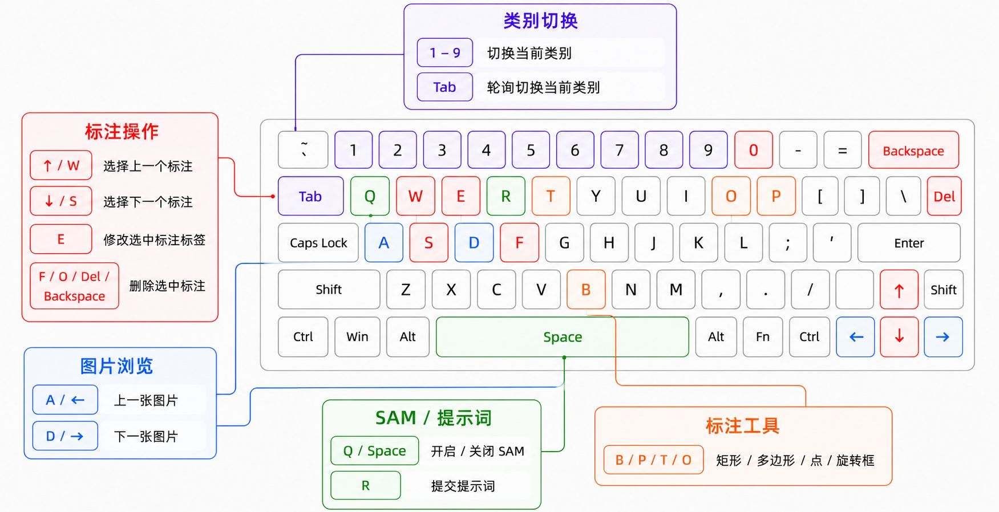
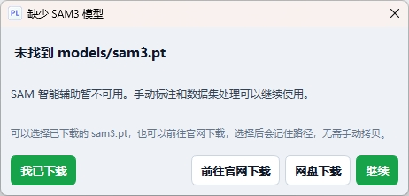

# PromptLabel

**语言**：中文 | [English](README.en.md)

<table>
<tr>
<td width="110" align="center"></td>
<td>PromptLabel 是一个基于 SAM3 的提示词辅助图像标注工作台：用多个提示词别名快速找到同一类目标，导出时仍保持干净、稳定的 YOLO 类别。</td>
</tr>
</table>

项目在界面和基础标注流程上参考并改造了 [LabelPaw](https://github.com/luohuabuxiema/LabelPaw)，不是原作者官方版本。

## 核心卖点

### 一类多提示词

一个训练类别可以绑定多个提示词别名，例如：

```text
helmet
├─ helmet
├─ hard hat
└─ ...
```

使用 SAM 文本提示时可以用任意别名找目标；保存和导出时仍然只写入 `helmet` 这个类别，避免把训练集类别拆乱。

### 连续标注更少打断

<p align="center">
  
</p>

## 界面截图

界面围绕左侧图片队列、中央画布、右侧类别/标注管理、底部 SAM 工作流组织。打开目录后可以直接浏览缩略图、勾选多张图片批量提交提示词，并在右侧完成类别、提示词别名、颜色和可见性管理。


## 功能概览

- 标注格式：`JSON` / `YOLO` / `XML`。
- 标注类型：矩形、多边形、点、旋转框。
- SAM3 辅助：点选、文本提示词、参考目标搜索。
- 类别管理：新增、编辑、删除、颜色、显示/隐藏、提示词别名。
- 图片队列：缩略图预览、复选多选、上一张/下一张、批量提示词标注、右键删除图片及同名标注。
- 标注管理：按类型分组、选择、批量改标签、批量删除、呼吸高亮。
- 数据集处理：训练/验证/测试集划分，JSON/XML 转 YOLO，JSON 转 U-Net Mask。

## 模型说明

Release 包不内置 `models/sam3.pt`。缺少模型时，主界面仍可打开，手动标注和数据集处理可继续使用，SAM 智能辅助不可用。首次启动时可以直接选择已有的 `sam3.pt`，程序会记住路径；也可以把模型放到：

```text
models/sam3.pt
```

建议优先从官方来源下载：

- [facebook/sam3 on Hugging Face](https://huggingface.co/facebook/sam3/tree/main)
- [facebookresearch/sam3](https://github.com/facebookresearch/sam3)

备用下载：

- [百度网盘 sam3.pt](https://pan.baidu.com/s/11rKzO6W5b_i8aOFcd9xOzA?pwd=6666)，提取码：`6666`

`sam3.pt` 属于 SAM Materials，受 `SAM_LICENSE.txt` 约束。使用或再分发前请确认遵守 Meta 的 SAM License。



## 运行方式

### Beta 便携包

1. 从 Release 页面下载 `PromptLabel-vX.X.X` 便携包。
2. 解压到同一个目录。
3. 可选：把 `sam3.pt` 放到 `models/sam3.pt`。
4. 双击 `PromptLabel.exe` 启动。

### 源码运行

推荐 Windows + Python 3.11 + NVIDIA CUDA 环境。

```powershell
python -m venv .venv311
.\.venv311\Scripts\pip install -r requirements.txt
.\.venv311\Scripts\python main.py
```

### 本地打包

```powershell
.\.venv311\Scripts\pip install pyinstaller
.\.venv311\Scripts\pyinstaller.exe --clean --noconfirm PromptLabel.spec
```

输出目录为 `dist\PromptLabel\`。Release 包不要包含 `models\sam3.pt`、`.sam3_tmp\`、日志、缓存或本地测试图片。


## 自动保存

PromptLabel 以自动保存为主。切换图片、编辑标注、删除标注等操作会自动保存到当前格式；状态栏会显示当前标注模式下的总数和分类统计。

## License

本项目沿用原项目许可，并保留 `SAM_LICENSE.txt` 用于说明 SAM3 相关许可信息。
